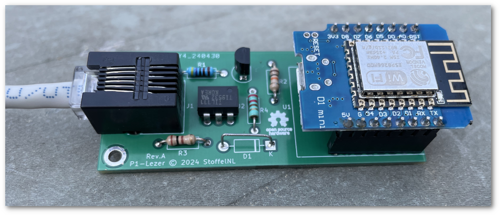

Een P1-Lezer voor Home Assistant
========

Dit is een simpele P1-lezer voor een 'slimme meter' die integreert met Home Assistant. De lezer is gebaseerd op een WiFi-controller zodat je 'm draadloos kunt verbinden met een home automation-systeem. De enige draad die je nodig hebt is een kabeltje om de lezer op de P1-poort van je slimme meter aan te sluiten.

Onderdelen
----------
Je vindt hier:
- een KiCad-project met een schema, een printplaat en Gerber-bestanden
waarmee je die print kunt laten maken.
- een YAML-bestand voor ESPHome (https://esphome.io/) waarmee je de Wifi-controller kunt programmeren.

### De hardware
Deze P1-lezer is gebaseerd op een ESP8266 WiFi-controller, de WeMos D1 Mini. Dat is een kleine goedkope microcontroller die in dit geval het seriële datasignaal van de slimme meter via een WiFi-verbinding naar je home-automation stuurt.
Je sluit de lezer met een zes-aderige RJ12-kabel aan op de meter.

In de P1-aansluiting worden vijf van de zes pinnen gebruikt (in de volgorde van de RJ12):

1. +5 Volt
2. Data Request
3. Data Ground
4. Not connected
5. Data Transmit
6. Ground

Deze lezer gebruikt ze allemaal. De 5 volt wordt gebruikt als voeding. De Data Request kan je gebruiken om het data-signaal te starten en stoppen (maar het hoeft niet). En de Data Transmit-lijn levert alle meetwaarden. De twee ground-aansluitingen worden aan elkaar gekoppeld.

### De software
Met het YAML-bestand kan je de ESP8266 programmeren. In deze versie is ook het uitlezen van de gasmeter opgenomen. Heb je geen gekoppelde gasmeter dan kan je dat stukje uit de YAML verwijderen.
Voordat je de D1 Mini gaat progammeren moet je eerst de naam van jouw WiFi-netwerk invullen, met het bijbehorende wachtwoord.